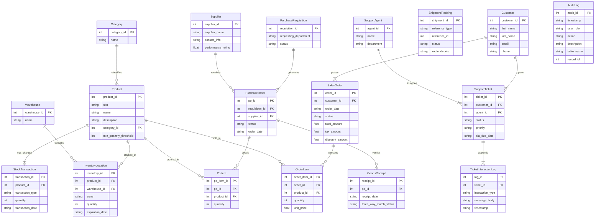

# AmbatuGrow ERP - Inventory Department Terminal

Welcome to the **AmbatuGrow ERP** repository. This branch is isolated and optimized exclusively for the **Inventory Department**, providing a high-performance, professional-grade terminal for tracking stock, managing transactions, mapping warehouse locations, and reporting.

---

## 📊 Entity-Relationship Diagram (ERD)

The database schema is designed for consistency, concurrency control (via pessimistic transaction locking), and full audit logging. Below is the interactive visual representation of our entities and their relationships.



---

## 🗃️ Data Dictionary

### 1. `Product`
Stores catalog details for agricultural seeds and products.
* **`product_id` (INT, PK)**: Unique product key.
* **`sku` (VARCHAR, Unique)**: Stock Keeping Unit identifier.
* **`name` (VARCHAR)**: Display name.
* **`description` (TEXT)**: Product specifications and guidelines.
* **`category_id` (INT, FK)**: Links to Category.
* **`min_quantity_threshold` (INT)**: Minimum limit triggering low-stock alerts.

### 2. `InventoryLocation`
Maps stock quantities to specific zones in warehouses.
* **`inventory_id` (INT, PK)**: Unique location record key.
* **`product_id` (INT, FK)**: Links to Product.
* **`warehouse_id` (INT, FK)**: Links to Warehouse.
* **`zone` (VARCHAR)**: Coordinate grid zone (e.g. A1, B2).
* **`quantity` (INT)**: Stock count in zone.
* **`expiration_date` (DATE)**: Expiration limit for perishable inventory.

### 3. `StockTransaction`
Maintains an immutable historical record of stock changes.
* **`transaction_id` (INT, PK)**: Unique transaction key.
* **`product_id` (INT, FK)**: Links to Product.
* **`transaction_type` (VARCHAR)**: Type of change (`ADJUSTMENT`, `TRANSFER`, `RECEIPT`, `DISPATCH`).
* **`quantity` (INT)**: Count delta (positive/negative).
* **`transaction_date` (TIMESTAMP)**: Action timestamp.

### 4. `PurchaseRequisition`
Internal request from department staffs for procurement restocking.
* **`requisition_id` (INT, PK)**: Unique requisition ID.
* **`requesting_department` (VARCHAR)**: Originating team context.
* **`status` (VARCHAR)**: Approvals workflow status (`pending`, `approved`, `rejected`).

### 5. `PurchaseOrder`
Outgoing order generated and sent to suppliers.
* **`po_id` (INT, PK)**: Unique PO reference.
* **`requisition_id` (INT, FK)**: Links back to requesting requisition.
* **`supplier_id` (INT, FK)**: Links to target Supplier.
* **`status` (VARCHAR)**: Order lifecycle state (`issued`, `completed`).
* **`order_date` (TIMESTAMP)**: PO creation timestamp.

### 6. `GoodsReceipt`
Details processed during goods inbound delivery verification (3-way match).
* **`receipt_id` (INT, PK)**: Unique GR key.
* **`po_id` (INT, FK)**: Links to matching PO.
* **`receipt_date` (TIMESTAMP)**: Check-in timestamp.
* **`three_way_match_status` (VARCHAR)**: Matching audit result (`matched`, `discrepancy`).

### 7. `Supplier`
Vendor directory records.
* **`supplier_id` (INT, PK)**: Unique vendor reference.
* **`supplier_name` (VARCHAR)**: Corporate vendor name.
* **`contact_info` (TEXT)**: Primary phone, address, and email coordinates.
* **`performance_rating` (FLOAT)**: Calculated SLA rating.

### 8. `Customer`
Storefront buyer directory accounts.
* **`customer_id` (INT, PK)**: Unique client profile ID.
* **`first_name` (VARCHAR)**: First name.
* **`last_name` (VARCHAR)**: Last name.
* **`email` (VARCHAR)**: Primary email.
* **`phone` (VARCHAR)**: Phone coordinates.

### 9. `SalesOrder`
Completed storefront checkout records.
* **`order_id` (INT, PK)**: Unique invoice ID.
* **`customer_id` (INT, FK)**: Buyer link.
* **`order_date` (TIMESTAMP)**: Checkout checkout timestamp.
* **`status` (VARCHAR)**: Processing lifecycle state.
* **`total_amount` (DECIMAL)**: Total paid value.

### 10. `AuditLog`
System activity audit trail of user actions.
* **`audit_id` (INT, PK)**: Unique log entry key.
* **`timestamp` (TIMESTAMP)**: Event time.
* **`user_role` (VARCHAR)**: Active session role of user.
* **`action` (VARCHAR)**: Operation name.
* **`description` (TEXT)**: Detailed breakdown delta.

---

## 🛠️ Getting Started

### Prerequisites
* PHP 8.1+
* Apache / WampServer (with MySQL support)

### Run Server Locally
1. Start your local server or run:
   ```bash
   php -S 127.0.0.1:8080 index.php
   ```
2. Navigate to [http://127.0.0.1:8080](http://127.0.0.1:8080) to access the Inventory Terminal interface.
