# AmbatuGrow ERP - Inventory Department Terminal
#https://prod.liveshare.vsengsaas.visualstudio.com/join?D7F34BE9096B310E51F3A7FEAD719F8C29A1
Welcome to the **AmbatuGrow ERP** repository. This branch is isolated and optimized exclusively for the **Inventory Department**, providing a high-performance, professional-grade terminal for tracking stock, managing transactions, mapping warehouse locations, and reporting.

---

## 📊 Entity-Relationship Diagram (ERD)

The database schema represents a 5-module enterprise architecture supporting core master data, warehouse inventory operations (WMS), procurement workflows (SCM), customer management (CRM), and helpdesk logistics.

```mermaid
erDiagram
    %% Core & Master Data
    Roles {
        varchar role_id PK
        varchar role_name
        varchar description
    }

    Users {
        varchar user_id PK
        varchar role_id FK
        varchar username
        varchar password
        varchar first_name
        varchar last_name
        varchar email
        string status
        timestamp created_at
    }

    Addresses {
        int address_id PK
        string street
        string city
        string province
        string zipcode
        string country
    }

    Units_of_Measure {
        int uom_id PK
        string uom_code
        string uom_name
        string description
    }

    Payment_Terms {
        int payment_term_id PK
        string term_code
        string description
        int net_days
        decimal discount_percent
    }

    Currencies {
        int currency_id PK
        char currency_code
        string currency_name
        decimal exchange_rate
    }

    %% Product & Inventory Management
    Categories {
        int category_id PK
        string category_name
        int parent_category_id FK
    }

    Products {
        int product_id PK
        string sku
        string name
        string description
        int category_id FK
        int uom_id FK
        int currency_id FK
        decimal base_price
        decimal min_quantity_threshold
        int lead_time_days
    }

    Warehouses {
        int warehouse_id PK
        string name
        int address_id FK
        decimal capacity_sqm
    }

    Warehouse_Zones {
        int zone_id PK
        int warehouse_id FK
        string zone_name
        string category
    }

    Inventory_Locations {
        int inventory_id PK
        int product_id FK
        int warehouse_id FK
        int zone_id FK
        decimal quantity
        date expiration_date
    }

    Stock_Transactions {
        int transaction_id PK
        int product_id FK
        int warehouse_id FK
        string transaction_type
        decimal quantity
        datetime transaction_date
        int reference_id
    }

    %% Procurement & Supply Chain
    Suppliers {
        int supplier_id PK
        string supplier_name
        string category
        string email
        string phone
        int address_id FK
        string status
    }

    Product_Suppliers {
        int product_id FK
        int supplier_id FK
        string supplier_sku
        decimal unit_price
        int lead_time_days
        tinyint is_preferred
    }

    Purchase_Orders {
        int po_id PK
        string po_number
        int supplier_id FK
        int requisition_id FK
        int payment_term_id FK
        int currency_id FK
        string status
        datetime order_date
        varchar created_by FK
    }

    PO_Items {
        int po_item_id PK
        int po_id FK
        int product_id FK
        decimal quantity
        int uom_id FK
        decimal unit_price
    }

    Supplier_Invoices {
        int invoice_id PK
        int supplier_id FK
        int po_id FK
        string invoice_number
        date invoice_date
        date due_date
    }

    %% Sales & Customer Management
    Customers {
        int customer_id PK
        string first_name
        string last_name
        string email
        string phone
        int address_id FK
    }

    Sales_Orders {
        int order_id PK
        int customer_id FK
        varchar rep_id FK
        datetime order_date
        string status
        int payment_term_id FK
        int currency_id FK
    }

    Billing_Details {
        int billing_id PK
        int order_id FK
        int address_id FK
        string payment_method
    }

    %% Helpdesk & Logistics
    Tickets {
        int ticket_id PK
        int customer_id FK
        int order_id FK
        string subject
        string priority
    }

    Shipments {
        int shipment_id PK
        string reference_type
        int reference_id
        int destination_address_id FK
    }

    %% Relationships
    Roles ||--o{ Users : "assigned_to"
    Addresses ||--o{ Warehouses : "located_at"
    Addresses ||--o{ Suppliers : "located_at"
    Addresses ||--o{ Customers : "located_at"
    Addresses ||--o{ Billing_Details : "billed_to"
    Addresses ||--o{ Shipments : "shipped_to"

    Categories ||--o{ Categories : "parent_to"
    Categories ||--o{ Products : "classifies"
    Units_of_Measure ||--o{ Products : "measures"
    Currencies ||--o{ Products : "priced_in"
    Currencies ||--o{ Purchase_Orders : "quoted_in"
    Currencies ||--o{ Sales_Orders : "charged_in"
    Payment_Terms ||--o{ Purchase_Orders : "applies_to"
    Payment_Terms ||--o{ Sales_Orders : "applies_to"

    Warehouses ||--o{ Warehouse_Zones : "contains"
    Products ||--o{ Inventory_Locations : "stored_at"
    Warehouses ||--o{ Inventory_Locations : "houses"
    Warehouse_Zones ||--o{ Inventory_Locations : "slots"
    
    Products ||--o{ Stock_Transactions : "logs"
    Warehouses ||--o{ Stock_Transactions : "records_at"

    Products ||--|{ Product_Suppliers : "supplied_by"
    Suppliers ||--|{ Product_Suppliers : "offers"

    Suppliers ||--o{ Purchase_Orders : "receives"
    Users ||--o{ Purchase_Orders : "creates"
    Purchase_Orders ||--o{ PO_Items : "contains"
    Products ||--o{ PO_Items : "ordered_in"
    Units_of_Measure ||--o{ PO_Items : "quantified_by"

    Suppliers ||--o{ Supplier_Invoices : "bills"
    Purchase_Orders ||--o{ Supplier_Invoices : "billed_by"

    Customers ||--o{ Sales_Orders : "places"
    Users ||--o{ Sales_Orders : "manages"
    Sales_Orders ||--o{ Billing_Details : "billing_ref"

    Customers ||--o{ Tickets : "files"
    Sales_Orders ||--o{ Tickets : "related_to"
```



---

## 🗃️ Data Dictionary

### **1. Core & Master Data**

#### `Roles`
User clearance and operations access control configuration profiles.
* `role_id` (VARCHAR(20), PK): Unique identification key.
* `role_name` (VARCHAR(100), UNIQUE): Display label for permission tiers.
* `description` (VARCHAR(255)): Breakdown details of features permitted.

#### `Users`
Individual accounts belonging to employees accessing the system terminal.
* `user_id` (VARCHAR(20), PK): Unique account identifier.
* `role_id` (VARCHAR(20), FK): Links back to the assigned Role.
* `username` (VARCHAR(50), UNIQUE): Unique username string.
* `password` (VARCHAR(255)): Secure password encryption hash.
* `first_name` (VARCHAR(100)): User's first name.
* `last_name` (VARCHAR(100)): User's last name.
* `email` (VARCHAR(100)): Primary employee email.
* `status` (ENUM('Active', 'Inactive'), DEFAULT 'Active'): User context state.
* `created_at` (TIMESTAMP): Creation timestamp.

#### `Addresses`
Central address directory mapped to warehouses, customers, suppliers, billing, and shipments.
* `address_id` (INT, PK): Unique identification key.
* `street` (VARCHAR): Full street address details.
* `city` (VARCHAR): Mapped city.
* `province` (VARCHAR): Mapped state/province.
* `zipcode` (VARCHAR): ZIP/Postal code.
* `country` (VARCHAR): Mapped country.

#### `Units_of_Measure`
Standard metric parameters defining products quantities and orders packing.
* `uom_id` (INT, PK): Unique key.
* `uom_code` (VARCHAR): Metric symbol (e.g., `KG`, `PCS`, `BAG`).
* `uom_name` (VARCHAR): Display label (e.g., `Kilograms`, `Pieces`, `Bags`).
* `description` (TEXT): UoM scope description.

#### `Payment_Terms`
Credit terms governing invoicing timelines and discounts.
* `payment_term_id` (INT, PK): Unique identification key.
* `term_code` (VARCHAR): Key label (e.g. `NET30`, `2/10 NET30`).
* `description` (TEXT): Explanatory terms.
* `net_days` (INT): Limit days for full invoice clearance.
* `discount_percent` (DECIMAL): Discount awarded for early settlements.

#### `Currencies`
Fiat currencies tracking dynamic exchange rates relative to base pricing.
* `currency_id` (INT, PK): Unique identifier.
* `currency_code` (CHAR): 3-character ISO code (e.g. `PHP`, `USD`).
* `currency_name` (VARCHAR): Display name.
* `exchange_rate` (DECIMAL): Spot rate reference.

---

### **2. Product & Inventory Management (PIM / WMS)**

#### `Categories`
Hierarchical taxonomy trees for agricultural catalog items.
* `category_id` (INT, PK): Unique category identifier.
* `category_name` (VARCHAR): Display classification tag.
* `parent_category_id` (INT, FK): Parent category link (for sub-categories hierarchy).

#### `Products`
Master index details for seed products.
* `product_id` (INT, PK): Unique catalog product identifier.
* `sku` (VARCHAR, UNIQUE): Stock Keeping Unit string.
* `name` (VARCHAR): Display name.
* `description` (TEXT): Product guidelines and details.
* `category_id` (INT, FK): Classified category reference.
* `uom_id` (INT, FK): Default unit of measure reference.
* `currency_id` (INT, FK): Default currency representation.
* `base_price` (DECIMAL): Standard product wholesale price.
* `min_quantity_threshold` (DECIMAL): Minimum safe inventory level before warning alerts.
* `lead_time_days` (INT): Manufacturing/replenishment time.

#### `Warehouses`
Physical storage facilities.
* `warehouse_id` (INT, PK): Unique warehouse identifier.
* `name` (VARCHAR): Display label.
* `address_id` (INT, FK): Physical warehouse address link.
* `capacity_sqm` (DECIMAL): Warehouse capacity square footage.

#### `Warehouse_Zones`
Specific storage slots and physical configurations inside a warehouse.
* `zone_id` (INT, PK): Unique warehouse zone key.
* `warehouse_id` (INT, FK): Parent warehouse link.
* `zone_name` (VARCHAR): Zone code (e.g., `A1`, `B2`).
* `category` (VARCHAR): Classification parameter (e.g. `Cold Storage`, `Dry Goods`).

#### `Inventory_Locations`
Real-time stock ledger linking products, warehouses, and specific zones.
* `inventory_id` (INT, PK): Unique stock record key.
* `product_id` (INT, FK): Stored product link.
* `warehouse_id` (INT, FK): Storage warehouse link.
* `zone_id` (INT, FK): Mapped coordinate zone slot.
* `quantity` (DECIMAL): Mapped stock units count.
* `expiration_date` (DATE, Nullable): Perishables expiry coordinate.

#### `Stock_Transactions`
Historical ledger logging all inbound, outbound, and internal movements.
* `transaction_id` (INT, PK): Unique transaction log reference.
* `product_id` (INT, FK): Target product.
* `warehouse_id` (INT, FK): Location warehouse reference.
* `transaction_type` (ENUM): Action delta (`Stock-in`, `Stock-out`, `Transfer`).
* `quantity` (DECIMAL): Units count.
* `transaction_date` (DATETIME): Event timestamp.
* `reference_id` (INT): Polymorphic link to source order details.

---

### **3. Procurement & Supply Chain (SCM)**

#### `Suppliers`
Vendor directory records.
* `supplier_id` (INT, PK): Unique supplier reference.
* `supplier_name` (VARCHAR): Corporate supplier entity name.
* `category` (VARCHAR): Product classifications supplied.
* `email` (VARCHAR): Secondary email.
* `phone` (VARCHAR): Phone contact details.
* `address_id` (INT, FK): Corporate coordinates address link.
* `status` (ENUM): Relationship state (`Active`, `Inactive`, `Blacklisted`).

#### `Product_Suppliers`
4NF associative junction map matching products to multiple suppliers.
* `product_id` (INT, Composite PK, FK): Reference link to catalog Product.
* `supplier_id` (INT, Composite PK, FK): Reference link to target Supplier.
* `supplier_sku` (VARCHAR): Supplier's custom internal SKU string.
* `unit_price` (DECIMAL): Quoted unit cost.
* `lead_time_days` (INT): Quoted vendor shipping delivery lead time.
* `is_preferred` (TINYINT): Boolean flag identifying prime supplier.

#### `Purchase_Orders`
Issued purchase orders tracking restocking.
* `po_id` (INT, PK): Unique PO identification key.
* `po_number` (VARCHAR, UNIQUE): Human-readable PO transaction code.
* `supplier_id` (INT, FK): Receiving vendor supplier link.
* `requisition_id` (INT, FK, Nullable): Source requisition link.
* `payment_term_id` (INT, FK): Transaction terms link.
* `currency_id` (INT, FK): Billing currency.
* `status` (VARCHAR): Order status (`Issued`, `Completed`, `Draft`).
* `order_date` (DATETIME): PO creation timestamp.
* `created_by` (VARCHAR(20), FK): Employee user placing the PO.

#### `PO_Items`
Individual item line details ordered within a Purchase Order.
* `po_item_id` (INT, PK): Unique identification key.
* `po_id` (INT, FK): Parent PO reference.
* `product_id` (INT, FK): Ordered catalog product.
* `quantity` (DECIMAL): Units amount.
* `uom_id` (INT, FK): Order UoM context.
* `unit_price` (DECIMAL): Locked PO unit price.

#### `Supplier_Invoices`
Supplier bills corresponding to completed orders.
* `invoice_id` (INT, PK): Unique invoice identifier.
* `supplier_id` (INT, FK): Issuing supplier.
* `po_id` (INT, FK): Mapped matching PO.
* `invoice_number` (VARCHAR): Invoice sequence.
* `invoice_date` (DATE): Billing issue date.
* `due_date` (DATE): Payment deadline date.

---

### **4. Sales & Customer Management (CRM)**

#### `Customers`
Customer profile directories.
* `customer_id` (INT, PK): Unique customer identifier.
* `first_name` (VARCHAR): First name.
* `last_name` (VARCHAR): Last name.
* `email` (VARCHAR): Contact email.
* `phone` (VARCHAR): Phone details.
* `address_id` (INT, FK): Customer shipping location coordinates.

#### `Sales_Orders`
Storefront client checkout transactions.
* `order_id` (INT, PK): Unique Sales Order identification key.
* `customer_id` (INT, FK): Buyer profile link.
* `rep_id` (VARCHAR(20), FK): Managing agent link referencing Users.
* `order_date` (DATETIME): Checkout date.
* `status` (VARCHAR): Processing state (`Completed`, `Pending`, `Cancelled`).
* `payment_term_id` (INT, FK): Billing payment terms.
* `currency_id` (INT, FK): Selected currency transaction.

#### `Billing_Details`
Transactional details for Sales Orders checkout transactions.
* `billing_id` (INT, PK): Unique billing profile key.
* `order_id` (INT, FK): Parent Sales Order link.
* `address_id` (INT, FK): Billing coordinates address link.
* `payment_method` (VARCHAR): Payment method (e.g. `Bank Transfer`, `Credit Card`).

---

### **5. Helpdesk & Logistics**

#### `Tickets`
CRM support tickets.
* `ticket_id` (INT, PK): Unique ticket reference key.
* `customer_id` (INT, FK): Submitting customer profile link.
* `order_id` (INT, FK, Nullable): Reference Sales Order link.
* `subject` (VARCHAR): Case title.
* `priority` (ENUM): Priority tier (`Low`, `Medium`, `High`, `Critical`).

#### `Shipments`
Tracking parameters for inbound supplier POs and outbound customer SOs.
* `shipment_id` (INT, PK): Unique shipments tracking reference.
* `reference_type` (ENUM): Mapped type (`Inbound`, `Outbound`).
* `reference_id` (INT): Polymorphic PO or SO reference link.
* `destination_address_id` (INT, FK): Destination location address link.

---

## 💾 Database Schema SQL DDL Script

You can view or copy the complete MySQL/MariaDB DDL database schema script below:

```sql
-- AmbatuGrow ERP - Complete Database Schema DDL Script
-- Target Engine: MySQL / MariaDB (InnoDB)

SET FOREIGN_KEY_CHECKS = 0;

-- -----------------------------------------------------
-- 1. Core & Master Data
-- -----------------------------------------------------

DROP TABLE IF EXISTS `Roles`;
CREATE TABLE `Roles` (
    `role_id` VARCHAR(20) PRIMARY KEY,
    `role_name` VARCHAR(100) UNIQUE NOT NULL,
    `description` VARCHAR(255) NULL
) ENGINE=InnoDB DEFAULT CHARSET=utf8mb4;

DROP TABLE IF EXISTS `Users`;
CREATE TABLE `Users` (
    `user_id` VARCHAR(20) PRIMARY KEY,
    `role_id` VARCHAR(20) NOT NULL,
    `username` VARCHAR(50) UNIQUE NOT NULL,
    `password` VARCHAR(255) NOT NULL,
    `first_name` VARCHAR(100) NOT NULL,
    `last_name` VARCHAR(100) NOT NULL,
    `email` VARCHAR(100) NOT NULL,
    `status` ENUM('Active', 'Inactive') NOT NULL DEFAULT 'Active',
    `created_at` TIMESTAMP DEFAULT CURRENT_TIMESTAMP,
    FOREIGN KEY (`role_id`) REFERENCES `Roles` (`role_id`)
) ENGINE=InnoDB DEFAULT CHARSET=utf8mb4;

DROP TABLE IF EXISTS `Addresses`;
CREATE TABLE `Addresses` (
    `address_id` INT AUTO_INCREMENT PRIMARY KEY,
    `street` VARCHAR(255) NOT NULL,
    `city` VARCHAR(100) NOT NULL,
    `province` VARCHAR(100) NOT NULL,
    `zipcode` VARCHAR(20) NOT NULL,
    `country` VARCHAR(100) NOT NULL
) ENGINE=InnoDB DEFAULT CHARSET=utf8mb4;

DROP TABLE IF EXISTS `Units_of_Measure`;
CREATE TABLE `Units_of_Measure` (
    `uom_id` INT AUTO_INCREMENT PRIMARY KEY,
    `uom_code` VARCHAR(10) NOT NULL,
    `uom_name` VARCHAR(50) NOT NULL,
    `description` TEXT NULL
) ENGINE=InnoDB DEFAULT CHARSET=utf8mb4;

DROP TABLE IF EXISTS `Payment_Terms`;
CREATE TABLE `Payment_Terms` (
    `payment_term_id` INT AUTO_INCREMENT PRIMARY KEY,
    `term_code` VARCHAR(20) NOT NULL,
    `description` TEXT NULL,
    `net_days` INT NOT NULL,
    `discount_percent` DECIMAL(5,2) NOT NULL DEFAULT 0.00
) ENGINE=InnoDB DEFAULT CHARSET=utf8mb4;

DROP TABLE IF EXISTS `Currencies`;
CREATE TABLE `Currencies` (
    `currency_id` INT AUTO_INCREMENT PRIMARY KEY,
    `currency_code` CHAR(3) NOT NULL,
    `currency_name` VARCHAR(50) NOT NULL,
    `exchange_rate` DECIMAL(10,4) NOT NULL DEFAULT 1.0000
) ENGINE=InnoDB DEFAULT CHARSET=utf8mb4;


-- -----------------------------------------------------
-- 2. Product & Inventory Management (PIM / WMS)
-- -----------------------------------------------------

DROP TABLE IF EXISTS `Categories`;
CREATE TABLE `Categories` (
    `category_id` INT AUTO_INCREMENT PRIMARY KEY,
    `category_name` VARCHAR(100) NOT NULL,
    `parent_category_id` INT NULL,
    FOREIGN KEY (`parent_category_id`) REFERENCES `Categories` (`category_id`) ON DELETE SET NULL
) ENGINE=InnoDB DEFAULT CHARSET=utf8mb4;

DROP TABLE IF EXISTS `Products`;
CREATE TABLE `Products` (
    `product_id` INT AUTO_INCREMENT PRIMARY KEY,
    `sku` VARCHAR(50) NOT NULL UNIQUE,
    `name` VARCHAR(255) NOT NULL,
    `description` TEXT NULL,
    `category_id` INT NOT NULL,
    `uom_id` INT NOT NULL,
    `currency_id` INT NOT NULL,
    `base_price` DECIMAL(10,2) NOT NULL DEFAULT 0.00,
    `min_quantity_threshold` DECIMAL(10,2) NOT NULL DEFAULT 0.00,
    `lead_time_days` INT NOT NULL DEFAULT 0,
    FOREIGN KEY (`category_id`) REFERENCES `Categories` (`category_id`),
    FOREIGN KEY (`uom_id`) REFERENCES `Units_of_Measure` (`uom_id`),
    FOREIGN KEY (`currency_id`) REFERENCES `Currencies` (`currency_id`)
) ENGINE=InnoDB DEFAULT CHARSET=utf8mb4;

DROP TABLE IF EXISTS `Warehouses`;
CREATE TABLE `Warehouses` (
    `warehouse_id` INT AUTO_INCREMENT PRIMARY KEY,
    `name` VARCHAR(100) NOT NULL,
    `address_id` INT NOT NULL,
    `capacity_sqm` DECIMAL(10,2) NOT NULL DEFAULT 0.00,
    FOREIGN KEY (`address_id`) REFERENCES `Addresses` (`address_id`)
) ENGINE=InnoDB DEFAULT CHARSET=utf8mb4;

DROP TABLE IF EXISTS `Warehouse_Zones`;
CREATE TABLE `Warehouse_Zones` (
    `zone_id` INT AUTO_INCREMENT PRIMARY KEY,
    `warehouse_id` INT NOT NULL,
    `zone_name` VARCHAR(50) NOT NULL,
    `category` VARCHAR(50) NOT NULL,
    FOREIGN KEY (`warehouse_id`) REFERENCES `Warehouses` (`warehouse_id`) ON DELETE CASCADE
) ENGINE=InnoDB DEFAULT CHARSET=utf8mb4;

DROP TABLE IF EXISTS `Inventory_Locations`;
CREATE TABLE `Inventory_Locations` (
    `inventory_id` INT AUTO_INCREMENT PRIMARY KEY,
    `product_id` INT NOT NULL,
    `warehouse_id` INT NOT NULL,
    `zone_id` INT NOT NULL,
    `quantity` DECIMAL(10,2) NOT NULL DEFAULT 0.00,
    `expiration_date` DATE NULL,
    FOREIGN KEY (`product_id`) REFERENCES `Products` (`product_id`),
    FOREIGN KEY (`warehouse_id`) REFERENCES `Warehouses` (`warehouse_id`),
    FOREIGN KEY (`zone_id`) REFERENCES `Warehouse_Zones` (`zone_id`)
) ENGINE=InnoDB DEFAULT CHARSET=utf8mb4;

DROP TABLE IF EXISTS `Stock_Transactions`;
CREATE TABLE `Stock_Transactions` (
    `transaction_id` INT AUTO_INCREMENT PRIMARY KEY,
    `product_id` INT NOT NULL,
    `warehouse_id` INT NOT NULL,
    `transaction_type` ENUM('Stock-in', 'Stock-out', 'Transfer') NOT NULL,
    `quantity` DECIMAL(10,2) NOT NULL,
    `transaction_date` DATETIME NOT NULL,
    `reference_id` INT NULL,
    FOREIGN KEY (`product_id`) REFERENCES `Products` (`product_id`),
    FOREIGN KEY (`warehouse_id`) REFERENCES `Warehouses` (`warehouse_id`)
) ENGINE=InnoDB DEFAULT CHARSET=utf8mb4;


-- -----------------------------------------------------
-- 3. Procurement & Supply Chain (SCM)
-- -----------------------------------------------------

DROP TABLE IF EXISTS `Suppliers`;
CREATE TABLE `Suppliers` (
    `supplier_id` INT AUTO_INCREMENT PRIMARY KEY,
    `supplier_name` VARCHAR(255) NOT NULL,
    `category` VARCHAR(100) NOT NULL,
    `email` VARCHAR(100) NOT NULL,
    `phone` VARCHAR(20) NOT NULL,
    `address_id` INT NOT NULL,
    `status` ENUM('Active', 'Inactive', 'Blacklisted') NOT NULL DEFAULT 'Active',
    FOREIGN KEY (`address_id`) REFERENCES `Addresses` (`address_id`)
) ENGINE=InnoDB DEFAULT CHARSET=utf8mb4;

DROP TABLE IF EXISTS `Product_Suppliers`;
CREATE TABLE `Product_Suppliers` (
    `product_id` INT NOT NULL,
    `supplier_id` INT NOT NULL,
    `supplier_sku` VARCHAR(50) NOT NULL,
    `unit_price` DECIMAL(10,2) NOT NULL DEFAULT 0.00,
    `lead_time_days` INT NOT NULL DEFAULT 0,
    `is_preferred` TINYINT(1) NOT NULL DEFAULT 0,
    PRIMARY KEY (`product_id`, `supplier_id`),
    FOREIGN KEY (`product_id`) REFERENCES `Products` (`product_id`) ON DELETE CASCADE,
    FOREIGN KEY (`supplier_id`) REFERENCES `Suppliers` (`supplier_id`) ON DELETE CASCADE
) ENGINE=InnoDB DEFAULT CHARSET=utf8mb4;

DROP TABLE IF EXISTS `Purchase_Orders`;
CREATE TABLE `Purchase_Orders` (
    `po_id` INT AUTO_INCREMENT PRIMARY KEY,
    `po_number` VARCHAR(50) NOT NULL UNIQUE,
    `supplier_id` INT NOT NULL,
    `requisition_id` INT NULL,
    `payment_term_id` INT NOT NULL,
    `currency_id` INT NOT NULL,
    `status` VARCHAR(50) NOT NULL,
    `order_date` DATETIME NOT NULL,
    `created_by` VARCHAR(20) NOT NULL,
    FOREIGN KEY (`supplier_id`) REFERENCES `Suppliers` (`supplier_id`),
    FOREIGN KEY (`payment_term_id`) REFERENCES `Payment_Terms` (`payment_term_id`),
    FOREIGN KEY (`currency_id`) REFERENCES `Currencies` (`currency_id`),
    FOREIGN KEY (`created_by`) REFERENCES `Users` (`user_id`)
) ENGINE=InnoDB DEFAULT CHARSET=utf8mb4;

DROP TABLE IF EXISTS `PO_Items`;
CREATE TABLE `PO_Items` (
    `po_item_id` INT AUTO_INCREMENT PRIMARY KEY,
    `po_id` INT NOT NULL,
    `product_id` INT NOT NULL,
    `quantity` DECIMAL(10,2) NOT NULL,
    `uom_id` INT NOT NULL,
    `unit_price` DECIMAL(10,2) NOT NULL,
    FOREIGN KEY (`po_id`) REFERENCES `Purchase_Orders` (`po_id`) ON DELETE CASCADE,
    FOREIGN KEY (`product_id`) REFERENCES `Products` (`product_id`),
    FOREIGN KEY (`uom_id`) REFERENCES `Units_of_Measure` (`uom_id`)
) ENGINE=InnoDB DEFAULT CHARSET=utf8mb4;

DROP TABLE IF EXISTS `Supplier_Invoices`;
CREATE TABLE `Supplier_Invoices` (
    `invoice_id` INT AUTO_INCREMENT PRIMARY KEY,
    `supplier_id` INT NOT NULL,
    `po_id` INT NOT NULL,
    `invoice_number` VARCHAR(100) NOT NULL,
    `invoice_date` DATE NOT NULL,
    `due_date` DATE NOT NULL,
    FOREIGN KEY (`supplier_id`) REFERENCES `Suppliers` (`supplier_id`),
    FOREIGN KEY (`po_id`) REFERENCES `Purchase_Orders` (`po_id`)
) ENGINE=InnoDB DEFAULT CHARSET=utf8mb4;


-- -----------------------------------------------------
-- 4. Sales & Customer Management (CRM)
-- -----------------------------------------------------

DROP TABLE IF EXISTS `Customers`;
CREATE TABLE `Customers` (
    `customer_id` INT AUTO_INCREMENT PRIMARY KEY,
    `first_name` VARCHAR(100) NOT NULL,
    `last_name` VARCHAR(100) NOT NULL,
    `email` VARCHAR(100) NOT NULL,
    `phone` VARCHAR(20) NOT NULL,
    `address_id` INT NOT NULL,
    FOREIGN KEY (`address_id`) REFERENCES `Addresses` (`address_id`)
) ENGINE=InnoDB DEFAULT CHARSET=utf8mb4;

DROP TABLE IF EXISTS `Sales_Orders`;
CREATE TABLE `Sales_Orders` (
    `order_id` INT AUTO_INCREMENT PRIMARY KEY,
    `customer_id` INT NOT NULL,
    `rep_id` VARCHAR(20) NOT NULL,
    `order_date` DATETIME NOT NULL,
    `status` VARCHAR(50) NOT NULL,
    `payment_term_id` INT NOT NULL,
    `currency_id` INT NOT NULL,
    FOREIGN KEY (`customer_id`) REFERENCES `Customers` (`customer_id`),
    FOREIGN KEY (`rep_id`) REFERENCES `Users` (`user_id`),
    FOREIGN KEY (`payment_term_id`) REFERENCES `Payment_Terms` (`payment_term_id`),
    FOREIGN KEY (`currency_id`) REFERENCES `Currencies` (`currency_id`)
) ENGINE=InnoDB DEFAULT CHARSET=utf8mb4;

DROP TABLE IF EXISTS `Billing_Details`;
CREATE TABLE `Billing_Details` (
    `billing_id` INT AUTO_INCREMENT PRIMARY KEY,
    `order_id` INT NOT NULL,
    `address_id` INT NOT NULL,
    `payment_method` VARCHAR(50) NOT NULL,
    FOREIGN KEY (`order_id`) REFERENCES `Sales_Orders` (`order_id`) ON DELETE CASCADE,
    FOREIGN KEY (`address_id`) REFERENCES `Addresses` (`address_id`)
) ENGINE=InnoDB DEFAULT CHARSET=utf8mb4;


-- -----------------------------------------------------
-- 5. Helpdesk & Logistics
-- -----------------------------------------------------

DROP TABLE IF EXISTS `Tickets`;
CREATE TABLE `Tickets` (
    `ticket_id` INT AUTO_INCREMENT PRIMARY KEY,
    `customer_id` INT NOT NULL,
    `order_id` INT NULL,
    `subject` VARCHAR(255) NOT NULL,
    `priority` ENUM('Low', 'Medium', 'High', 'Critical') NOT NULL DEFAULT 'Low',
    FOREIGN KEY (`customer_id`) REFERENCES `Customers` (`customer_id`),
    FOREIGN KEY (`order_id`) REFERENCES `Sales_Orders` (`order_id`) ON DELETE SET NULL
) ENGINE=InnoDB DEFAULT CHARSET=utf8mb4;

DROP TABLE IF EXISTS `Shipments`;
CREATE TABLE `Shipments` (
    `shipment_id` INT AUTO_INCREMENT PRIMARY KEY,
    `reference_type` ENUM('Inbound', 'Outbound') NOT NULL,
    `reference_id` INT NOT NULL,
    `destination_address_id` INT NOT NULL,
    FOREIGN KEY (`destination_address_id`) REFERENCES `Addresses` (`address_id`)
) ENGINE=InnoDB DEFAULT CHARSET=utf8mb4;

SET FOREIGN_KEY_CHECKS = 1;
```

---

## ⚙️ Core Logic Functions

The AmbatuGrow ERP uses a hybrid architecture combining a **custom PHP Database Facade (PDO-backed Eloquent Stub Engine)** on the backend and **Modern Vanilla Javascript Event Controllers** on the frontend.

### 1. Database Transaction & Pessimistic Lock Engine (PHP)
The backend architecture implements Laravel Eloquent stubs that simulate enterprise-grade pessimistic concurrency controls using a PHP/PDO wrapper class `MockDB`.

* **Active Locking (`lockForUpdate`)**:
  When performing stock transfers or adjustments, the system acquires a simulated row-level pessimistic lock (`FOR UPDATE`) to prevent concurrent modification anomalies:
  ```php
  class QueryBuilder {
      // ...
      public function lockForUpdate() {
          \MockDB::logLock($this->modelClass, $this->wheres);
          return $this;
      }
  }
  ```
* **Transaction Facade (`DB::beginTransaction`, `DB::commit`, `DB::rollBack`)**:
  Protects inventory updates. If an operation fails mid-way, the transaction rolls back the MySQL database modifications to maintain schema integrity:
  ```php
  namespace Illuminate\Support\Facades {
      class DB {
          public static function beginTransaction() {
              \MockDB::beginTransaction();
          }
          public static function commit() {
              \MockDB::commit();
          }
          public static function rollBack() {
              \MockDB::rollBack();
          }
      }
  }
  ```

---

### 2. Live Inventory Search, Filters & Sorting (Javascript)
The frontend handles data rendering, sorting, and multi-criteria filters client-side without page refreshes.

* **Multi-Criteria Table Rendering**:
  Event listeners on filters (Warehouse select, Category select, Status select) and search inputs capture changes and rebuild the DOM rows:
  ```javascript
  function renderInventoryTable() {
      const tbody = document.querySelector('#inventory-table tbody');
      let filtered = [...state.inventory];

      // 1. Apply Global SKU/Name search text filter
      const searchVal = globalSearch.value.toLowerCase();
      if (searchVal) {
          filtered = filtered.filter(item => 
              item.p.sku.toLowerCase().includes(searchVal) || 
              item.p.name.toLowerCase().includes(searchVal)
          );
      }

      // 2. Apply Warehouse Location coordinate filter
      const whVal = filterWh.value;
      if (whVal) {
          filtered = filtered.filter(item => item.warehouse_id === parseInt(whVal));
      }

      // 3. Sort Table Column dynamically
      if (state.sortColumn === 'qty') {
          filtered.sort((a, b) => state.sortDirection === 'asc' 
              ? a.quantity - b.quantity 
              : b.quantity - a.quantity
          );
      }
      // Rebuild Table DOM elements...
  }
  ```
* **Interactive Table Header Sorting**:
  Header click listeners call `toggleSort()` to flip sort state directions:
  ```javascript
  function toggleSort(column) {
      if (state.sortColumn === column) {
          state.sortDirection = state.sortDirection === 'asc' ? 'desc' : 'asc';
      } else {
          state.sortColumn = column;
          state.sortDirection = 'asc';
      }
      renderInventoryTable();
  }
  ```

---

### 3. Pessimistic Lock & Transaction Trace Visualizer (JS + PHP API)
When stock adjustments or transfers are successfully committed, the backend returns the transaction log and pessimistic lock log arrays in the JSON response. The client-side visualizer parses and displays this execution trace live:
```javascript
function showTraceLogs(txLogs, lockLogs) {
    traceModal.classList.remove('hidden');
    traceTxLog.textContent = txLogs && txLogs.length 
        ? txLogs.join('\n') 
        : 'No transaction events logged.';
    traceLocksLog.textContent = lockLogs && lockLogs.length 
        ? lockLogs.join('\n') 
        : 'No pessimistic locks acquired.';
}
```

---

### 4. Theme Memory Persistence (Javascript + CSS Variables)
Theme preference is toggled client-side and saved to browser memory to persist across sessions:
```javascript
themeToggleBtn.addEventListener('click', () => {
    const isDark = document.body.classList.toggle('dark-theme');
    localStorage.setItem('theme', isDark ? 'dark' : 'light');
});
```

---

## 🛠️ Getting Started

### Prerequisites
* PHP 8.1+
* Apache / WampServer (with MySQL support)

### Run Server Locally
1. Start your local server or run:
   ```bash
   php -S 127.0.0.1:8080 index.php
   ```
2. Navigate to [http://127.0.0.1:8080](http://127.0.0.1:8080) to access the Inventory Terminal interface.
